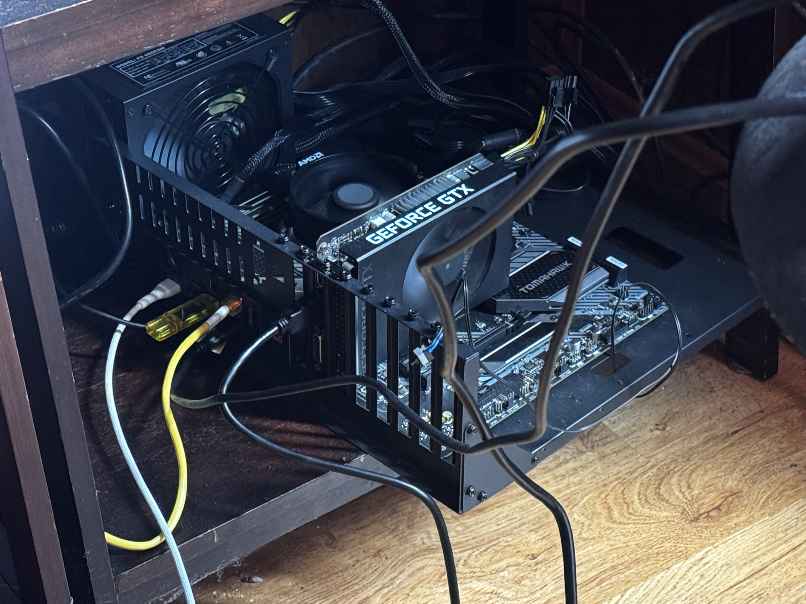
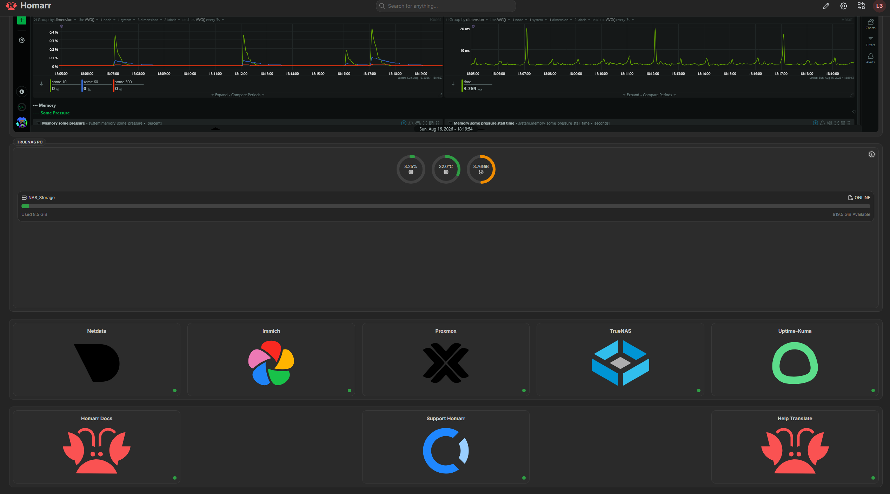
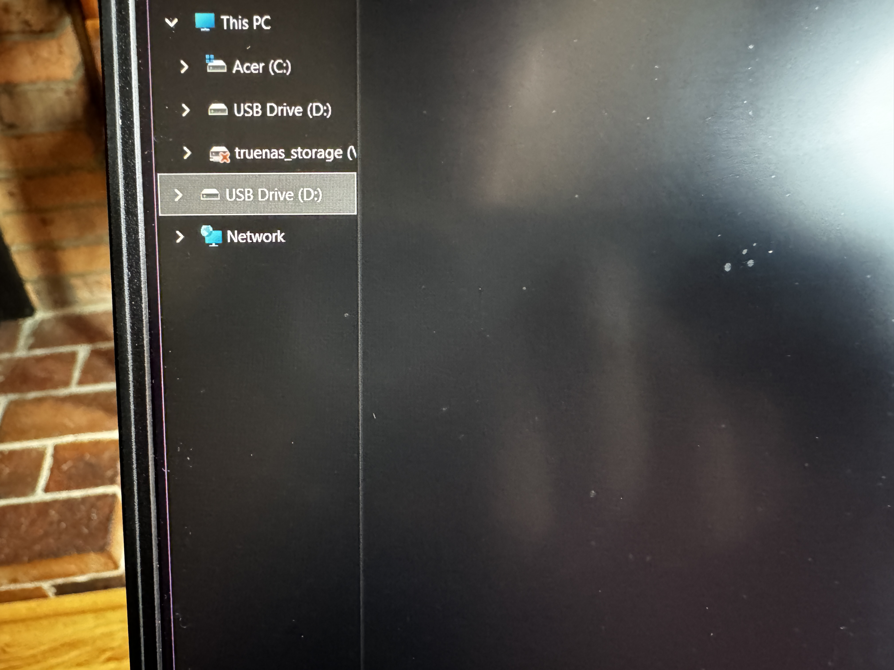
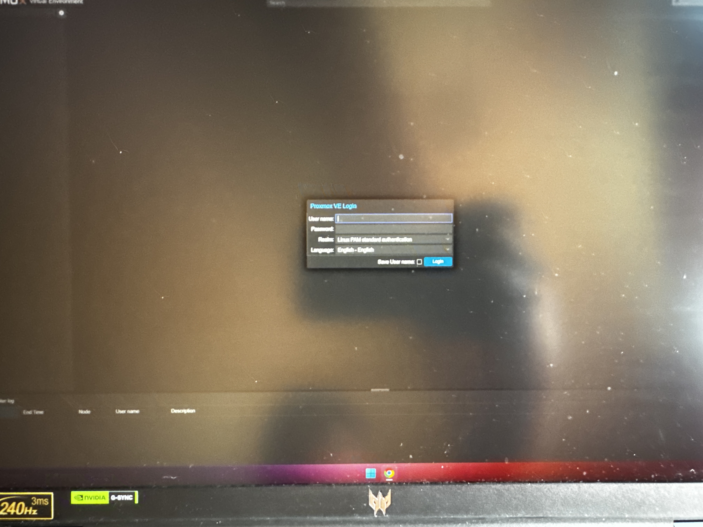

# LXC's HomeLab
A GitHub repo dedicated to my homelab
## Overview
My network setup consists of an 8 port network switch which has the following devices connected to it:
1. Gaming PC
2. TrueNAS Server
3. Proxmox Server
4. Camera Receiver
5. ISP router/modem combo
### Gaming PC
My personal PC and what I use to remotely manage my other servers, as well as my laptop
### TrueNAS Server
The TrueNAS server is in charge of storage for my local network, I use it to transport files from one device to another. My NAS (Network Attached Storage) is currently running 
both Netbird for VPN (Virtual Private Network) access and Immich as a self hosted image 
backup service.
### Proxmox Server

The Proxmox Server is in charge of running containers. The server has 1 virtual machine with its main purpose being docker which has the following services:
1. Portainer
2. Netdata
3. Uptime-Kuma
4. Homarr
#### Portainer

I use Portainer to streamline my docker app installations so instead of relying solely on the docker CLI (Command Line Interface), I can do it all from the web UI (User Interface)
#### Netdata

I use data to see real time statistics about my Proxmox system like CPU (Central Processing Unit) usage, storage utilization, RAM (Random Access Memory) usage, etc
#### Uptime-Kuma

I use this to check on the status of the Netdata web UI, while its capable of monitoring more complex services at the moment I only have it tracking my Netdata web UI
#### Homarr

I use Homarr to display all my apps/services in a graphical dashboard where I can click an icon and get sent to that specific service, instead of having to type IP addresses to access my services
### Camera Receiver
This device is used to receive video data from the cameras around my house via Wi-Fi
### ISP Router/Modem Combo
This Xfinity router/modem combo is how I get access to WAN (Wide Area Network)
## Architecture

## Hardware / Software Stack
#### Hardware
###### GB(Gigabytes), SSD (Solid State Drive), NVMe (Non-Volatile Memory Express), TB (Terabyte), HDD (Hard Disk Drive)
###### Take into account that both servers were made out of free and used PC parts
||Gaming PC|TrueNAS Server|Proxmox Server|
|--|--|--|--|
|CPU|Ryzen 7 5800XT|Intel I5-8400|Ryzen 5 3500|
|RAM|16 GB|8 GB|8 GB|
|Storage|500 GB NVMe SDD, 2TB SSD, 2TB HDD|1TB HDD + 2TB HDD|1TB Portable HDD|
|Power Supply|650 Watt|450 Watt|650 Watt|
#### Software
||Gaming PC|TrueNAS Server|Proxmox Server| 
|--|--|--|--|
|OS (Operating System)|Windows 11|TrueNAS Community Edition|Proxmox, Ubuntu server (Virtual Machine OS)|
|Software|WakeOnLAN|Immich & Netbird|Docker, Portainer, Uptime-Kuma, Netdata, and Homarr|
## Setup Process
#### TrueNAS Server
To setup my TrueNAS server I installed TrueNAS community edition ISO on a USB drive and with a special software flashed the ISO on the drive so that it could be installed on to 
another drive. Then, I plugged the USB drive with the OS into the server as well as another USB drive to act as the boot drive for the server. After the installation was complete 
and the server rebooted, I was able to see the IP address of the server to access the web UI. Then once I was in the web UI, I made a storage pool and used SMB to make it usable for network storage, afterwards I created storage volumes and then downloaded and deployed Immich and Netbird in the built in apps section of TrueNAS
#### Proxmox Server

Similar to the TrueNAS server, I had to install an ISO image on a USB drive and install the OS on another USB drive, and wait for the OS to install and the computer to reboot, but to make virtual machines I had to enable virtualzations in my motherboard's BIOS.  
Then afterwards, I would use the IP address shown in the terminal to login to the web UI. Afterwards, in the web UI I installed the OSs I was going to use for my virtual machines 
and then configured my virtual machines with adequate specs.
###### NOTE: I do not recommend that you use USB drives as a boot device since they will wear out easily, I'm using them because I don't have other storage options.
## Issues and Troubleshooting
I ran into a bunch of issues while making this homelab happen so I will list them out by device:
#### TrueNAS Server
1. Storage Drive Failure - This issue happened out of nowhere. I was using an SSD as my main storage in my NAS until one day I see that I have no storage capacity, when I checked
the web UI I see an error message saying that my SSD was offline, to this day I don't understand why the drive failed, but to fix the issue I purchased both the HDDs current in the system
#### Proxmox Server
1. Installation Type Error - When trying to download Proxmox I had to install a specific version of it since any other version would cause my PC to hard lock and not let me use any utility or command to shut down and try again
2. Storage Error - One day after rebooting my server I see that my virtual machines weren't turning on, when I checked logs I see that it says that storage did not exist, so after realizing that I had to remount my drive so it was visible to Proxmox I was able to recreate my virtual machines and redownload my OSs and continue creating my homelab, I believe the issue was that I shutdown the server without shutting down the virtual machines which could've caused data to corrupt

3. VLAN error / Network interface confusion - My original plan for the home lab was for it to include VLANs but as you will soon read that ended being a very difficult obstacle that I decided not to follow through with for now. I was originally intending to have another virtual machine act as a router using Pfsense so I could route traffic between VLANs, but I soon realized that not how things work, since the virtual machine only had 1 NIC (Network Interface Card), the interfaces for both WAN and LAN would be in the same subnet, so I attempted to use another IP address for the LAN interface and kept messing around with virtual network interfaces configurations, like adding other Virtual NICs  until I eventually gave up, I'm almost certain that the issue resides with having a router with the WAN set to the IP of my local network as well as having only 1 NIC. I would like to revisit this topic in the future if I can get my hands on a mini rack and more network hardware
 
###### NOTE: A lot of troubleshooting was made easier thanks to Claude AI and Google searches
###### If you have any questions about my project please let me know on Linkedin @ https://www.linkedin.com/in/luis-cruz-membreno-245513422
